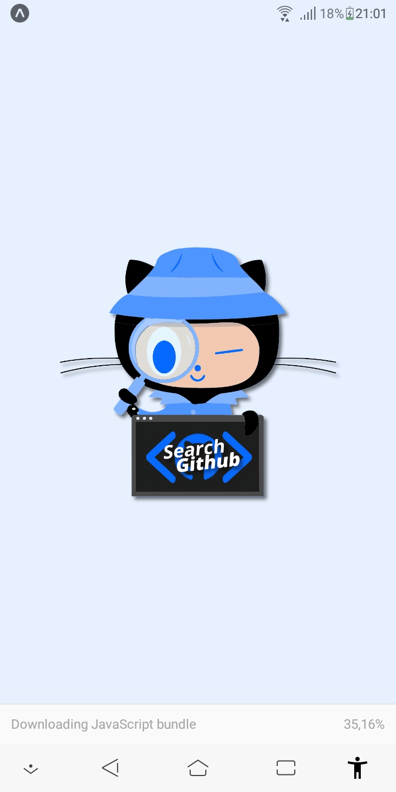

<h1 align="center">SearchGithub
	<br/>
	
	<br/>
</h1>

[](https://github.com/LeoMSSilva)
[](https://github.com/LeoMSSilva)
[](#)
[](https://github.com/LeoMSSilva/SearchGithub/stargazers)
[](https://github.com/LeoMSSilva/SearchGithub/network/members)
[](https://github.com/LeoMSSilva/SearchGithub/graphs/contributors)

---

# :pushpin: Table of Contents

- :house: [About](#house-about)
- :dart: [Installation](#dart-installation)
  - :gear: [Install dependencies](#hammer_and_wrench-install-dependencies)
  - :rocket: [Getting started](#rocket-getting-started)
- :computer: [Techs](#computer-techs)
- :bust_in_silhouette: [Author](#bust_in_silhouette-author)
- :handshake: [Contributing](#handshake-contributing)
- :scroll: [License](#scroll-license)

---

# :house: About

This project was developed with **React Native** and using the **Expo**.

I used **Axios** to consume the data from the github's public api, and through it I made all the requests.

The **Moment** was used to format the dates.

The **React Navigator Stack** to build navigation between the app's screens.

**Styled Components** to style the components.

I also got the app icons from the **Expo Vector Icons**.

This app is used to search for users on github.

---

# :dart: Installation

**First you need to install:**

- [Node.js](https://pt-br.nodejs.org/) (required)
- [Yarn](https://yarnpkg.com/) (optional)
- [Expo](https://expo.io/) (required)

  **Then in order, clone the project.**

By HTTPS, running this command:

```bash
  git clone https://github.com/LeoMSSilva/SearchGithub.git
```

Or by ssh, running this command:

```bash
  git clone git@github.com:LeoMSSilva/SearchGithub.git
```

SSH is a secure protocol, but you need to register a key ssh in your github before.

## :hammer_and_wrench: Install dependencies

```bash
  yarn
```

or

```bash
  yarn install
```

## :rocket: Getting Started

```bash
  yarn start
```

---

# :computer: Techs

- Axios
- Expo
- Expo/vector-icons
- Moment
- React
- React-native
- React-navigation/native
- Styled-components
- Typescript

---

# :bust_in_silhouette: Author

**LeoMSSilva**

- Github: [@LeoMSSilva](https://github.com/LeoMSSilva)
- LinkedIn: [@LeoMSSilva](https://linkedin.com/in/LeoMSSilva)

---

# :handshake: Contributing

Contributions, issues and feature requests are welcome! Feel free to **file a new issue** on the [SearchGithub](https://github.com/LeoMSSilva/SearchGithub/issues) repository. If you already found a solution to your problem, **I would love to review your pull request**!

---

# :scroll: License

Copyright :copyright: 2021 [LeoMSSilva](https://github.com/LeoMSSilva).
<br/>
This project is [MIT](https://github.com/LeoMSSilva/SearchGithub/blob/main/LICENSE) licensed.

---
